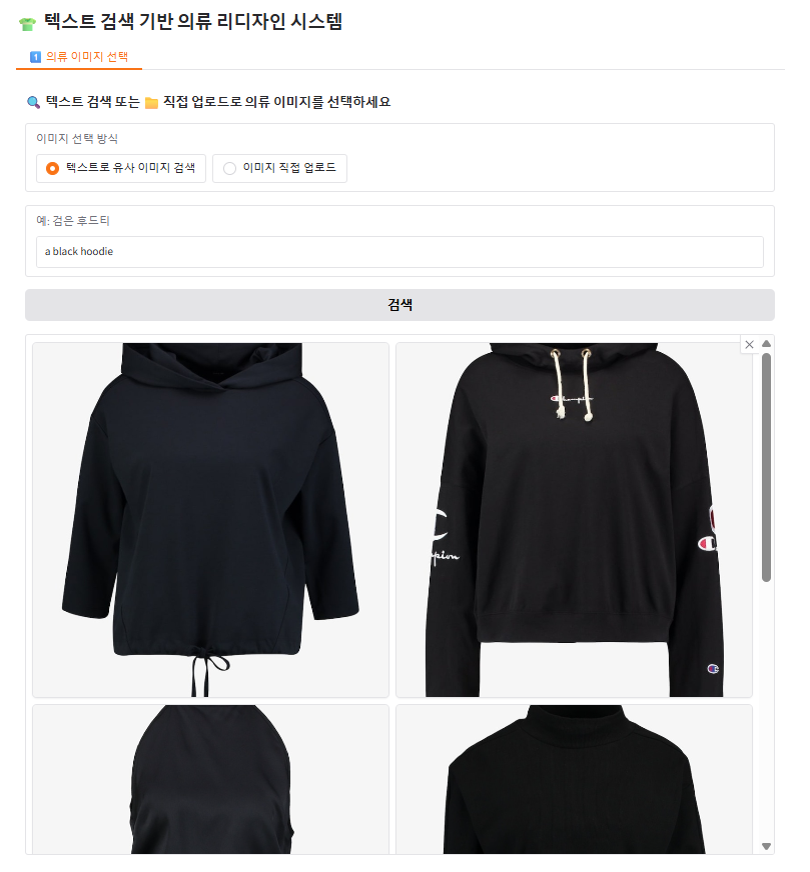

# 👕 AI 기반 의류 리디자인 및 가상 시착 시스템

텍스트 기반 검색부터 리디자인, 그리고 사용자의 실제 사진 위에 의류를 입혀보는 **End-to-End 패션 AI 서비스**입니다.  
CLIP, Stable Diffusion, ControlNet 기반으로 구성되어 있으며, Gradio를 통해 직관적인 UI를 제공합니다.

---

## ✨ 주요 기능

| 기능 | 설명 |
|------|------|
| 🔍 텍스트 기반 의류 이미지 검색 | 예: “검은색 후드티” → 유사 이미지 추천 (CLIP 기반) |
| ✏️ 프롬프트 자동 생성 | 스타일, 각도, 조명 설정 기반 텍스트 생성 (LLM 활용) |
| 🎨 이미지 리디자인 | Stable Diffusion으로 스타일 변경 |
| 📈 CLIPScore 평가 및 프롬프트 개선 | 생성된 이미지의 품질을 자동 평가하고, 프롬프트 개선 수행 |
| 🧍 사용자 사진 가상 착용 | 사용자의 실제 사진에 리디자인된 옷을 입혀보기 (ControlNet 기반) |
| 🖼️ Gradio 기반 UI 제공 | 모든 기능을 탭 기반 인터페이스로 체험 가능 |

## ⚙️ 사용 기술

- **Frontend**: Gradio
- **Backend API**: FastAPI
- **AI Models**:
  - CLIP (text-image retrieval & evaluation)
  - OpenAI gpt-4o (prompt generation & refinement)
  - Stable Diffusion (image redesign)
  - ControlNet / IDM-VTON  (virtual try-on) https://github.com/yisol/IDM-VTON?tab=readme-ov-file 
- **Preprocessing**: PIL, OpenCV, NumPy

---
